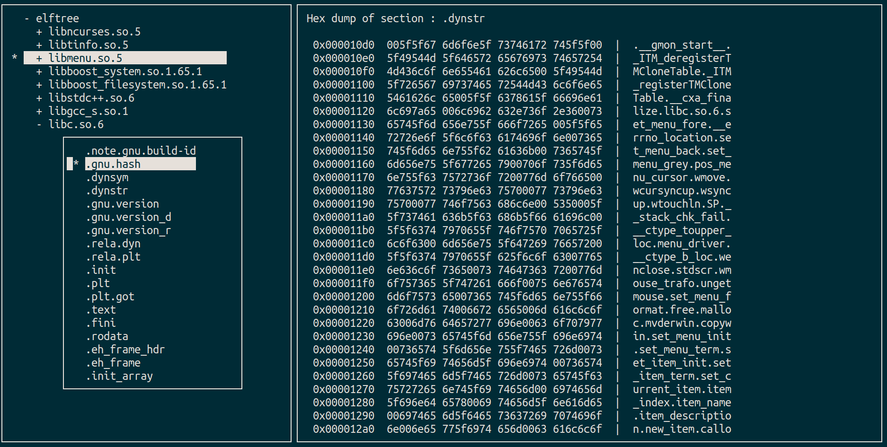
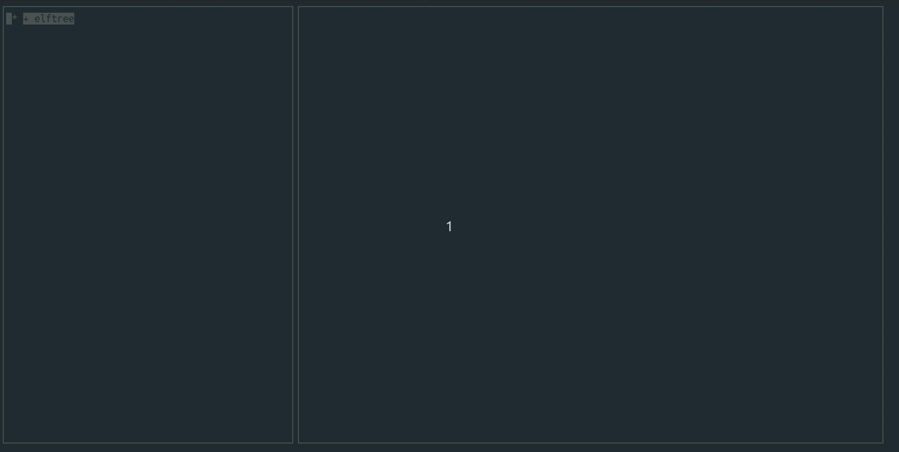

# elftree

The **ELFtree** is a project to debug ELF's library dependency.
The dependency relationship can be expressed in a tree structure and various information such as ELF Header, Program Header, Section Header, etc.

### Supported Architectures
- armv7l
- aarch64
- i586
- x86_64

### Key interface
* `←`: Fold
* `→`: Unfold
* `↓`: Move down
* `↑`: Move up
* `Page Up`: Scroll up ELF information
* `Page Down`: Scroll down ELF information
* `s`: Displays a list of sections and prints a dump of the section selected by the user.
* `d`: Prints a dump of the entered address by the user.

### Additional Function
#### 1. 's' : View section dump

#### 2. 'd' : View address dump

